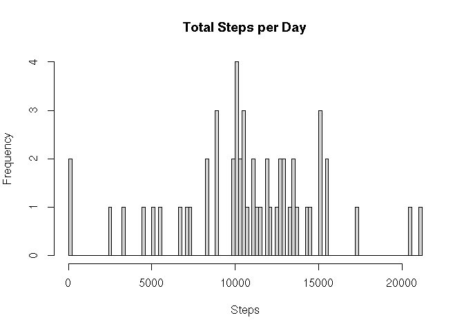
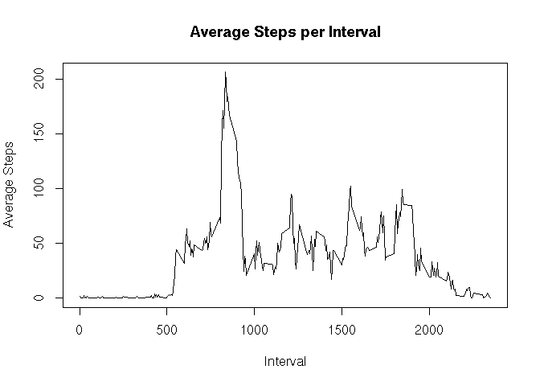
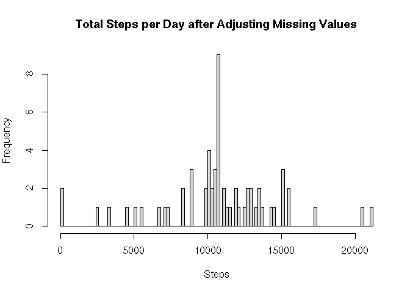
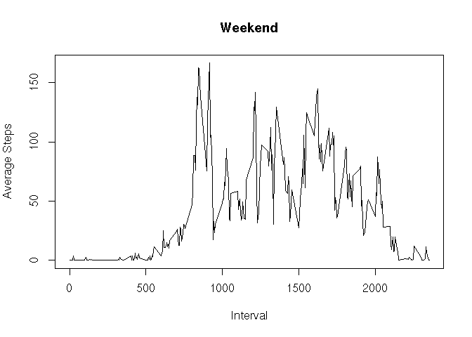
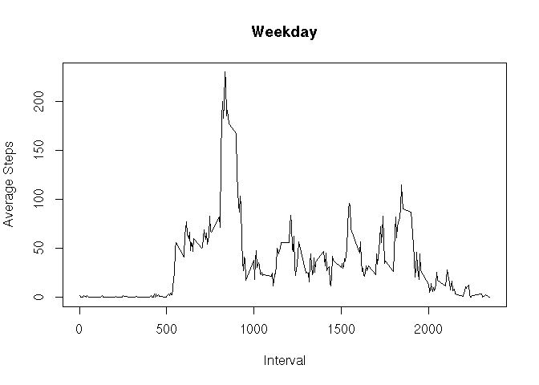

Set the output directory for figures

```r
knitr::opts_chunk$set(fig.path = 'figures/')
```

## Loading and preprocessing the data
First data is read from the zip file. The values in the date field are then 
converted from character to Date.

```r
activity_data <- read.csv(unz("activity.zip", "activity.csv"))
activity_data$date <- as.Date(activity_data$date)
```

## What is mean total number of steps taken per day?
The total steps per day (excluding NA values) are calculated and a histogram is 
plotted.

```r
total_steps_per_day <-
  aggregate(steps ~ date, FUN = sum, data = activity_data)

hist(
  total_steps_per_day$steps,
  breaks = 100,
  ylab = "Frequency",
  xlab = "Steps",
  main = "Total Steps per Day"
)
```

<!-- -->

The mode and median of the total steps per day are also determined.

```r
summary_of_data <- summary(total_steps_per_day$steps)
```

```r
print(summary_of_data[["Mean"]])
```

```
## [1] 10766.19
```

```r
print(summary_of_data[["Median"]])
```

```
## [1] 10765
```

## What is the average daily activity pattern?
The average steps per interval (excluding NA values) are calculated and plotted.

```r
avg_steps_per_interval <-
  aggregate(steps ~ interval, FUN = mean, data = activity_data)

plot(
avg_steps_per_interval,
type = "l",
xlab = "Interval",
ylab = "Average Steps",
main = "Average Steps per Interval"
)
```

<!-- -->

The five minute interval containing the maximum average is also calculated.

```r
max_avg_steps_interval_row <- which.max(avg_steps_per_interval$steps)
print(avg_steps_per_interval[max_avg_steps_interval_row, ])
```

```
##     interval    steps
## 104      835 206.1698
```
The maximum number of average steps is 
206.1698113
 and the corresponding five minute interval is 
 835

## Imputing missing values
For calculating the rows with missing values, at least one column in the row 
must contain NA.

```r
# Get details about fields that have NA values
na_flags <- is.na(activity_data)

# Calculate number of rows having NA.
# First is.na returns TRUE or FALSE depending on value in each cell.
# Then apply is used to calculate the max (TRUE = 1, FALSE = 0) of each row.
# Adding these individual values gives total rows containing NA.
print(sum(apply(is.na(activity_data), 1, max)))
```

```
## [1] 2304
```
Here, 2304 rows have NA values.


```r
# Using a similar approach, but applying the max function on columns instead
# of rows, columns having NA values can be determined. The columns having 1 in 
# the output contain NA values.
print(apply(is.na(activity_data), 2, max))
```

```
##    steps     date interval 
##        1        0        0
```
For this data set, only the **steps** column has NA values.

For filling the NA values, the mean of all non-NA values of that interval, 
rounded to the nearest integer is used.

```r
# Create a new variable to hold the data set with NAs removed
activity_data_final <- activity_data

# Build list of row numbers where steps are NA
rows_with_na_steps <-
  rownames(activity_data_final[is.na(activity_data_final$steps),])

# Set mean value from the data calculated earlier
for (row_num in 1:length(rows_with_na_steps)) {
  # As rows_with_na_steps is a list of rows, rows_with_na_steps[row_num] is 
  # what is actually needed
  row <- rows_with_na_steps[row_num]
  activity_data_final[row, "steps"] <-
    round(avg_steps_per_interval[avg_steps_per_interval$interval
                                 == activity_data_final[row, "interval"], 
                                 "steps"])
}
```

For this new data set with NAs removed, the histogram of daily step count is 
plotted and also the mean and median are determined.

```r
total_steps_per_day <-
  aggregate(steps ~ date, FUN = sum, data = activity_data_final)

hist(
  total_steps_per_day$steps,
  breaks = 100,
  ylab = "Frequency",
  xlab = "Steps",
  main = "Total Steps per Day after Adjusting Missing Values"
)
```

<!-- -->

```r
summary_of_data <- summary(total_steps_per_day$steps)
```

```r
print(summary_of_data[["Mean"]])
```

```
## [1] 10765.64
```

```r
print(summary_of_data[["Median"]])
```

```
## [1] 10762
```

## Are there differences in activity patterns between weekdays and weekends?
First a new factor variable indicating whether the date is a weekday or a 
weekend is added.

```r
activity_data_final$date_type <-
  factor(
    weekdays(activity_data_final$date),
    levels = c(
      "Monday",
      "Tuesday",
      "Wednesday",
      "Thursday",
      "Friday",
      "Saturday",
      "Sunday"
    ),
    labels = c(
      "Weekday",
      "Weekday",
      "Weekday",
      "Weekday",
      "Weekday",
      "Weekend",
      "Weekend"
    )
  )
```

The average steps per interval are calculated separately for weekdays and 
weekends.

```r
avg_steps_per_interval <-
  aggregate(steps ~ date_type + interval, FUN = mean, data = activity_data_final)
```

The plots for average steps are then generated.

```r
plot(
  steps ~ interval,
  type = "l",
  xlab = "Interval",
  ylab = "Average Steps",
  main = "Weekend",
  data = avg_steps_per_interval[avg_steps_per_interval$date_type == "Weekend", ]
)

plot(
  steps ~ interval,
  type = "l",
  xlab = "Interval",
  ylab = "Average Steps",
  main = "Weekday",
  data = avg_steps_per_interval[avg_steps_per_interval$date_type == "Weekday", ]
)
```


